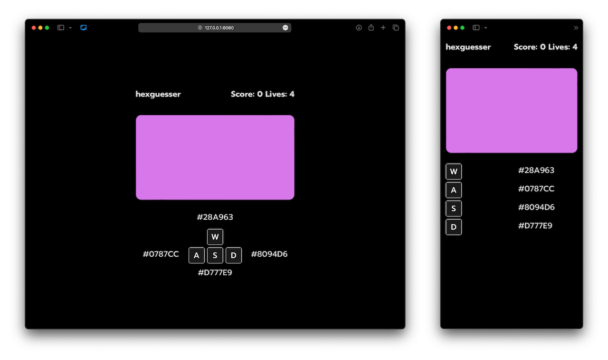

# hexguesser

A 24 bit hexadecimal color guessing game. It is build using vite, typescript, vanilla css, and react.



## Building

```bash
npm i
npm run build
```

## Running

```bash
npm start
```

## Usage

Make a selection with `w`, `a`, `s`, or `d`. You start with 5 lives, and the game resets when you run out. Clicking the color will generate a new one, this has no effect on your score.

## License

[MIT](https://choosealicense.com/licenses/mit/)
